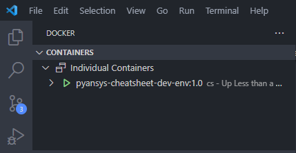
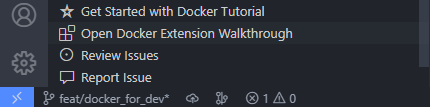
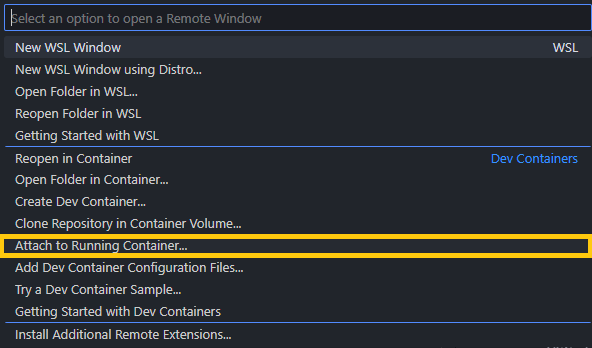
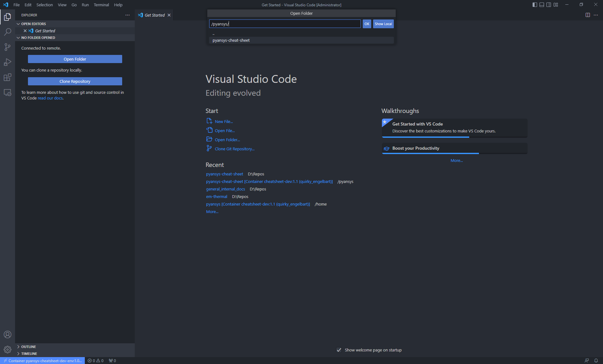

# Cheatsheet Development Environment Using Docker

In these instructions, we will create a development environment using Docker. This environment will be used to develop the cheatsheet without worrying about dependencies and environment setup.

## Prerequisites
- Basic environment setup for Python development. Please refer to [Developement Environment](https://github.com/ansys-internal/pyansys-trainings/raw/main/material/06-pyansys-examples/Contributing_to_PyAnsys_v1.0.pptx)
- [Visual Studio Code](https://code.visualstudio.com/download)
- [Docker VSCode Extension](https://code.visualstudio.com/docs/containers/overview)
- [Rancher](https://rancherdesktop.io/)
- [VS Code WSL Remote Extension](https://marketplace.visualstudio.com/items?itemName=ms-vscode-remote.remote-wsl)
- [VS Code Dev Container Extension](https://marketplace.visualstudio.com/items?itemName=ms-vscode-remote.remote-containers)


>**NOTE:** Install all the above prerequisites and make sure they are enabled and working. Make sure to install the extensions authored by Microsoft. For more details, please refer to the documentation of each extension.

## Steps to create the docker image, containerize and attach to VSCode for cheatsheet development:
1. Clone the repository using following command:
    ```bash
    git clone https://github.com/ansys/pyansys-cheat-sheet.git
    ```
2. Open the repository in VSCode.
3. Open a new terminal in VSCode.
4. Build the docker image using the following command:
    ```bash
    docker build -t pyansys-cheatsheet-dev-env:1.0 -f docker\Dockerfile .
    ```
>**NOTE:** It will take approximately 15-25 minutes to build the docker image. It will download all the dependencies and install them in the docker image.    

5. Make sure the docker image is created using the following command:
    ```bash
    docker image ls
    ```      
6. Run the docker image using the following command with container name as `dev`:
    ```bash
    docker run --name dev -ti pyansys-cheatsheet-dev-env:1.0
    ```    
7. Make sure the docker container created in VSCode docker extension and active with the image.:<br>
<br>
8. Click on WSL extension in VSCode from bottom left corner.<br>
<br>
9. Once it clicked, it will open a command palette. Select `Attached to Running Container` option and select the `dev` container.<br>
<br>
10. Once it is attached, it will open a new VSCode window. This window is attached to the docker container. Now, we can use this window to develop the cheatsheet.<br>
<br>
11. Open the `pyansys-cheat-sheet` folder in the new VSCode window from root `/`. This folder is mounted from the docker container. Do the development in this window and publish it on github.<br>
